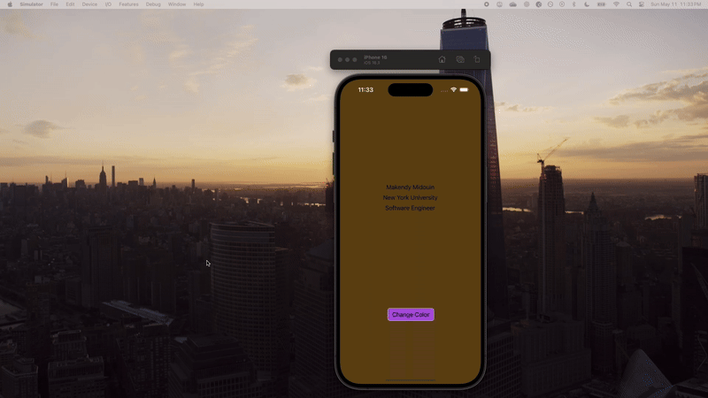

# Prework - *ColorChanger*

Submitted by: **Makendy Midouin**

**ColorChanger** is an app that displays three labels and allows users to change the background color of the screen to a random color by tapping a button.

Time spent: **1.5** hours spent in total

## Required Features

The following **required** functionality is completed:

- [x] Users see a screen with three labels and a button  
- [x] Tapping the button changes the screen color to a random color

## Video Walkthrough

Here is a reminder on how to embed Loom videos on GitHub. Feel free to remove this reminder once you upload your README.

## App Brainstorming (Step 4)

### Favorite Apps & Features

1. **Spotify**
   - Smart song recommendations based on listening history
   - Ability to download songs for offline listening
   - Cross-device syncing and playback continuation

2. **Instagram**
   - Story highlights that let users archive and feature stories
   - Explore page with tailored content
   - Easy-to-use image editing and filters

3. **Notion**
   - Flexible page structure for organizing thoughts or tasks
   - Integration of databases, calendars, and to-do lists
   - Real-time collaboration and sharing options

4. **Google Maps**
   - Real-time traffic updates and rerouting
   - Street View for previewing locations
   - Saved places and custom lists

5. **Duolingo**
   - Gamified learning with streaks and rewards
   - Immediate feedback after each question
   - Practice reminders and personalized progress tracking

---

### App Idea: **FocusFriend**

### App Idea: **Lift**

**Lift** is a lightweight mobile app that helps first-generation college students stay motivated and organized through daily encouragement, goal tracking, and simple journaling. Inspired by my own journey as a first-gen student from Haiti, the app is designed to make users feel supported even when they’re navigating things alone.

Features:
- **Daily Uplift**: A motivational quote or story each day
- **Mini Goals**: Create and check off small academic or personal goals
- **Quick Journal**: Write one sentence a day to reflect or vent
- **Progress View**: A simple calendar that shows goal progress and journal streaks

The goal is to keep things light and approachable—just enough structure to help users stay on track, but without adding pressure.

## Notes

Describe any challenges encountered while building the app:

- Getting the button to update the background color in real time required understanding `UIColor` generation.  
- Needed to double-check layout constraints to get labels aligned correctly.

## License
Copyright 2025 Makendy Midouin

Licensed under the Apache License, Version 2.0 (the "License");
you may not use this file except in compliance with the License.
You may obtain a copy of the License at

    http://www.apache.org/licenses/LICENSE-2.0

Unless required by applicable law or agreed to in writing, software
distributed under the License is distributed on an "AS IS" BASIS,
WITHOUT WARRANTIES OR CONDITIONS OF ANY KIND, either express or implied.
See the License for the specific language governing permissions and
limitations under the License.
